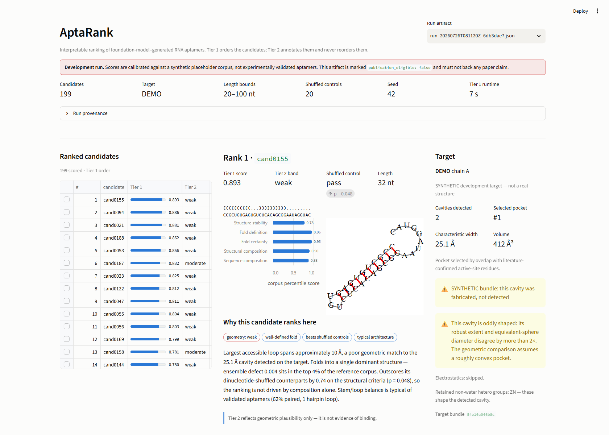

# AptaRank

Two-tier evaluation and ranking of foundation-model-generated RNA aptamer candidates.

You supply a file of candidate RNA sequences and a target protein identifier.
AptaRank scores every candidate, returns a ranked shortlist, and shows the
evidence behind each ranking.

**AptaRank does not predict binding.** Tier 1 measures intrinsic structural
quality against a corpus of experimentally validated aptamers. Tier 2 measures
whether a candidate's loop geometry is *plausible* against a cavity detected on
the target. Tier 2 annotates the ranking and never reorders it.

> Tier 2 provides a control-calibrated, target-specific geometric
> size-agreement annotation — not a binding prediction — and never alters the
> target-independent Tier 1 ranking.

A "strong" band means **strong control-relative geometric agreement**: this
candidate's loop matches this cavity's dimensions better than ~95% of
dinucleotide-shuffled controls do. It does not mean "strong candidate", and it
certainly does not mean "binds". The band colours are steps of one hue rather
than a green/amber/red status palette for exactly that reason.

Implements `IMPLEMENTATION_SPEC.md`; see [Deviations from the spec](#deviations-from-the-spec)
for the places where the implementation deliberately differs.

---



## Status

| Component | State |
| --- | --- |
| Ingest & validation (§4.3) | done |
| Tier 1 features: composition, folding, elements, ensemble sampling (§4.4–4.7) | done |
| Shuffled controls (§4.8) | done |
| Corpus precompute + cache, percentile scoring (§3.5.1, §4.9) | done |
| Composite scoring and ranking (§4.9, §6) | done |
| Tier 2: target prep, fpocket, geometry, calibration bank, banding (§5) | done |
| Spearman tier-independence diagnostic (§6.4) | done, every run |
| Run artifact (§7.2), rule-based explanations (§7.3), diagrams (§7.4) | done |
| Streamlit dashboard, panels (a)–(f) (§7.1) | done |
| Evaluation E1, E2, E4, E5 (§8) | done |
| Evaluation E3 (matched vs decoy target) | machinery done; needs labelled pairs + per-target bundles |
| Electrostatics (§5.7, stretch) | implemented, never required; skipped when APBS is absent |

**Two things block real results, both external:**

1. **The reference corpus has not been delivered.** Until it is, runs must use
   `--development-corpus`, which calibrates against synthetic data and stamps
   the artifact `publication_eligible: false`.
2. **Target bundles for NDM-1 / KPC-2 have not been built.** fpocket does not
   run on Windows; bundles come from the pinned Linux CI workflow. For local
   development, `scripts/make_dev_target.py` writes a *synthetic* bundle, which
   also marks the run ineligible for publication.

A run is publishable only when both its reference distributions and its target
evidence are real; `development_reasons` in the artifact says which are not.

---

## Install

Python 3.10+. On Windows, use a CPython install (not the MSYS2 one).

```bash
python -m venv .venv
.venv/Scripts/python -m pip install -e ".[dev]"
```

### ushuffle on Windows

`pip install ushuffle` fails on Python ≥ 3.9: the sdist ships pre-generated
Cython C that references `tp_print`, removed from CPython in 3.9. Build it from
the `.pyx` instead — `setup.py` re-cythonizes when Cython is importable, which
build isolation prevents:

```bash
.venv/Scripts/python -m pip install cython setuptools wheel
.venv/Scripts/python -m pip download ushuffle --no-binary :all: --no-deps -d /tmp/ush
tar -xzf /tmp/ush/ushuffle-1.1.2.tar.gz -C /tmp/ush
.venv/Scripts/python -m pip install --no-build-isolation /tmp/ush/ushuffle-1.1.2
```

Requires the MSVC build tools. Verified working with Cython 3.2.9 / MSVC 14.38.

### fpocket and APBS (Tier 2 only)

Both are Linux CLIs with no Windows build. Tier 1 does not need them. See
[Tier 2 tooling](#tier-2-tooling).

---

## Quickstart

```bash
# 1. synthetic development data (NOT scientific data)
python scripts/make_dev_data.py
python scripts/make_dev_target.py            # synthetic target bundle

# 2. precompute the reference feature matrix once
python -m aptarank corpus build --development-corpus data/corpus/dev_placeholder_corpus.csv

# 3. score a candidate batch, Tier 1 only
python -m aptarank run data/demo_candidates.csv \
    --development-corpus data/corpus/dev_placeholder_corpus.csv

# 4. ...or both tiers, against a target
python -m aptarank run data/demo_candidates.csv \
    --development-corpus data/corpus/dev_placeholder_corpus.csv --target DEMO

# 5. inspect a run, then open the dashboard
python -m aptarank artifact summary runs/run_*.json
streamlit run dashboard/streamlit_app.py
```

Real targets, on Linux (or in the `target-bundle` CI workflow):

```bash
python -m aptarank target build --pdb-id 3SPU --chain A \
    --set 'tier2.target.active_site_residues=[120,122,189]' \
    --set 'tier2.target.retain_hetero_resnames=["ZN"]'
python scripts/verify_target_bundle.py cache/targets/3SPU_*.bundle.json --rebuild
```

Every tunable lives in `configs/default.yaml` and can be overridden per run:

```bash
python -m aptarank run candidates.csv --corpus data/corpus/validated.csv \
    --set tier1.shuffle.n_shuffles=99 --set output.n_diagrams=100
```

`--fast` skips shuffled controls and ensemble sampling for exploratory runs.

---

## Repository layout

```
configs/default.yaml            every tunable; copied verbatim into each artifact
src/aptarank/
  config.py                     layered config + the criteria registry
  ingest.py                     §4.3 read, normalise, validate, deduplicate
  provenance.py                 tool versions, content hashes, seed derivation
  pipeline.py                   headless orchestration
  cli.py                        run / corpus build / artifact summary
  tier1/
    folding.py                  the only ViennaRNA entry point (§4.5, §4.7, §7.4)
    elements.py                 forgi structural elements (§4.6)
    features.py                 per-sequence features + parallel batch driver
    shuffles.py                 dinucleotide-preserving controls (§4.8)
    corpus.py                   reference corpus load, precompute, cache (§3.5.1)
    scoring.py                  corpus percentiles + composite (§4.4, §4.9)
    service.py                  Tier 1 orchestration and the ranking
  tier2/
    target.py                   fetch, chain selection, hetero policy (§5.3)
    fpocket.py                  strict runner + parser for fpocket output (§5.4)
    geometry.py                 robust pocket extent, aptamer reach (§5.4–5.6)
    selection.py                which cavity is the functional one (§5.4)
    bundle.py                   immutable checksummed target evidence
    build.py                    the one module that needs fpocket (Linux)
    calibration.py              fixed control bank, percentiles, bands (§5.8)
    apbs.py                     electrostatics, always optional (§5.7)
    service.py                  annotate the survivors; never reorder them
  artifacts/
    io.py                       run artifact assembly and I/O (§7.2)
    explanation.py              rule-based explanations (§7.3)
    rendering.py                embedded structure diagrams (§7.4)
  evaluation/
    groups.py                   comparison groups + target-grouped folds (§8.1)
    experiments.py              E1–E5 (§8.2)
    stats.py                    effect sizes, bootstrap CIs, retrieval metrics
    figures.py                  paper figures, drawn from stored results only
dashboard/                      Streamlit app; reads artifacts, computes nothing
scripts/                        dev data, dev target bundle, bundle verifier
.github/workflows/              tests (Linux + Windows) and target-bundle builds
tests/                          117 tests, including the §4.5–4.6 spec fixtures
```

Boundaries that matter: workers fold, the parent scores (the corpus is never
shipped to a subprocess); the dashboard and evaluation scripts will read
artifacts only and compute nothing of their own.

---

## Deviations from the spec

Each of these is a deliberate change, not an oversight.

### 1. `tier1_score` is absolute, not a within-batch rank aggregate (§4.9)

The spec's §4.9 snippet computes the composite from `rankdata` *within the
submitted batch*. That makes a candidate's score depend on what else was
submitted alongside it: a batch of one scores 1.0 on every criterion, small
batches get very coarse scores, and two runs cannot be compared.

It also breaks evaluation E1, which compares `tier1_score` distributions across
three separately-scored groups — under batch ranking those distributions are
identical uniform distributions by construction unless all three groups are
pooled into one scoring batch.

Implemented instead: each criterion is scored as a corpus percentile
(`criteria.X.score`, absolute and batch-independent), the composite is their
weighted mean, and the submitted batch determines only the ordinal `rank`.
`batch_rank_fraction` is stored separately for display. The literal spec
behaviour remains available via `tier1.composite.method: batch_rank_aggregation`.

This preserves the spec's stated intent — *"ranking is computed within the
submitted batch, percentile scores are computed against the corpus"* — which
the snippet contradicts.

### 2. Shuffle pass uses a Monte-Carlo p-value, not a 0.95 percentile (§4.8)

Beating 19 of 20 controls is a descriptive 95% win rate, not a 0.05-level test:
with the candidate pooled among M controls, the top two positions already
account for 2/(M+1) ≈ 9.5% of the ranks. `shuffle_pass` is now

```
p = (1 + #{control >= real}) / (M + 1)      pass iff p <= alpha
```

With M=20 and α=0.05 that requires beating all 20 controls (p = 0.048). Both
`percentile` and `p_value` are stored. Config validation rejects an α that the
configured M can never attain. **Publication runs should use `n_shuffles: 99`.**

### 3. Structural sub-score excludes GC and length (§4.8)

Dinucleotide shuffling preserves both exactly, so they contribute an identical
constant to a candidate and all of its controls, compressing the margin without
adding information.

### 4. The artifact embeds SVGs instead of referencing paths (§7.2)

A JSON file containing `svg_path` entries pointing outside itself is not
self-contained. Diagrams are embedded as SVG text; `output.embed_svg: false`
disables them.

### 5. Additional artifact provenance

Beyond §7.2: `artifact_schema_version`, git commit + dirty flag, input file
SHA-256, corpus hashes and `is_placeholder` / `publication_eligible`, the
scoring signature, per-candidate `batch_rank_fraction`, `rank_min` /
`rank_is_tied`, and shuffle `p_value` / `complete` / `n_unique`. Unavailable
values are `null` — NaN is not valid JSON.

### 7. Silent-failure guards

Every one of these turns a class of silent wrong answer into a loud one:

* Each shuffle is checked to preserve the **k-mer multiset**, not merely the
  letter multiset — that is the property §4.8 actually claims.
* A missing criterion weight is an error, never an implicit zero: a typo would
  otherwise change what the composite means while still producing a number.
* Non-finite feature or reference values are rejected before scoring. NaN sorts
  to the top of a percentile and would read as a perfect candidate.
* The corpus cache key includes the full ViennaRNA model settings
  (temperature, dangles, noLP, uniq_ML, …), not just tool versions — those can
  change every cached number while leaving version strings identical.
* Sampled structures are validated for length, balance and alphabet before
  forgi sees them; a dropped sample would bias the loop-size distribution that
  is Tier 2's only input.
* Per-candidate seeds are derived from `(run_seed, candidate_id, sequence,
  purpose)`, so results do not depend on process-pool scheduling and a reused
  input id cannot collide two sequences onto one random stream.

### 6. Missing corpus is a hard failure

There is no automatic fallback. `--development-corpus` is the only way to run
without real reference data, and it marks the artifact ineligible for
publication and prints a warning on every run.

### 8. `d_pocket` is a robust extent, not twice the RMS spread (§5.4)

The spec's `2 * singular_value / sqrt(n)` is twice the RMS spread of the
alpha-sphere centres — a dispersion statistic, not a cavity width. We compute a
5–95% quantile extent along each principal axis, projecting sphere *surfaces*
(`z ± r`) rather than centres, since what a loop must reach across is the
cavity rather than the set of points at its middle. The RMS spreads, the
centres-only extents and the equivalent-sphere diameter are all stored beside
it, and a cavity whose extent and equivalent diameter disagree by more than 2×
is flagged rather than silently scored.

### 9. The flexible descriptor is primary, contour length is the check (§5.5)

`6 Å × L` is contour length: it assumes a fully extended loop and therefore
over-penalises long loops, which bend. The √L flexible-chain proxy is primary;
contour length is reported as the upper-bound sensitivity analysis. Neither
`flex_c` nor `sigma` is ever tuned on E3.

### 10. Bands come from a fixed control bank, not the submitted batch (§5.8)

The spec derives band thresholds from the shuffles of whatever batch was
submitted, which makes a candidate's band depend on its co-submissions and
leaves the thresholds undefined for small batches. Instead a fixed bank of
corpus-derived dinucleotide shuffles is folded once and reused for every target
and batch; only the pocket arithmetic is redone per target.

Bands are defined on the **control percentile of the absolute mismatch**, not
on the Gaussian score — the Gaussian underflows at large mismatches and depends
on `sigma`, and a display parameter must not be able to move a candidate
between bands. `tier2_control_percentile` is also what evaluation E3 compares,
since raw scores are not comparable across targets.

### 11. E1 is scored out of fold, split by target (§8.2)

As specified, E1 is circular: the validated aptamers define the corpus
percentiles and are then the positive group. Folds are grouped by target, so no
held-out sequence is scored against its own target's family. A dinucleotide-
shuffled hard negative is added alongside the IID random control. See
[evaluation/README.md](evaluation/README.md).

---

## Target bundles

fpocket and APBS are Linux-only. Per §5.2 every target-derived quantity is
computed once per run — the per-candidate part is arithmetic on two numbers — so
the heavy tools are isolated behind a **target bundle**: an immutable,
checksummed JSON containing every detected pocket, the alpha-sphere coordinates
inline, the full selection evidence, the hetero policy actually applied, and
tool provenance. Scoring consumes the bundle and needs no external tools.

Bundles are produced by `.github/workflows/target-bundle.yml` on a pinned
`ubuntu-24.04` runner. That workflow *is* the reproducibility story: it
recomputes every stored geometric quantity from the inline spheres, re-derives
the bundle id, and rebuilds the whole bundle to confirm the scientific payload
is byte-stable, before uploading it. Anyone can re-run it and check the id.

`bundle_id` is a SHA-256 over the scientific payload **plus the tool identity
that produced it** — the fpocket version, command line and exit code are inside
the hash, so they cannot be edited without detection; timestamps, git state and
CI run ids are outside it, so two honest builds of the same evidence agree.

### Testing fpocket without fpocket

The parser is pinned against hand-built fixtures covering CRLF, negative and
scientific numbers, inconsistent label spacing, five-digit residue numbers,
missing required fields, sphere-count disagreements and missing files — every
one of which must raise rather than produce a plausible wrong number.

Hand-built fixtures only prove the parser understands the format we *imagined*,
so the CI job also runs the real tool and packages its complete output as a
downloadable fixture archive. **Commit that archive under
`tests/fixtures/fpocket/real/` once per fpocket version bump** — an expiring
Actions artifact is not durable auditability.

Local development uses synthetic bundles from `scripts/make_dev_target.py`,
flagged `synthetic: true`, which taints the run's publication eligibility.

---

## Development

```bash
.venv/Scripts/python -m pytest -q      # 117 tests
```

`tests/test_folding.py` pins the spec §4.5–4.6 fixture values
(mfe −17.9, mfe_norm −0.4475, ensemble defect 0.0092, and the exact forgi
element decomposition). If those move, something upstream changed and every
downstream number is suspect.

CI runs the suite on Linux and Windows across Python 3.10 and 3.11, including
the ushuffle source build, and smoke-tests the headless pipeline end to end.

### One bug worth knowing about

`ushuffle.Shuffler` stores a raw `char*` to the bytes it is constructed with and
does not hold a reference to them. Passing `sequence.encode()` inline lets that
temporary be collected, after which every subsequent `shuffle()` returns reused
memory. On Windows this surfaced loudly as a `UnicodeDecodeError` for 28% of
candidates — but bytes that happened to stay in the ASCII range would have
passed silently and quietly invalidated every §4.8 statistic. The buffer is now
held, and every shuffle is checked to preserve the k-mer multiset.
